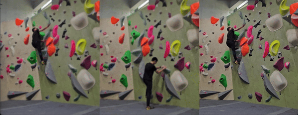

# Video Stabilizer



A video stabilizer using SIFT features. Sadly I was unable to find a free stabilization app to help me stabilize my climbing videos the way I want it so I guess I gotta write one myself.

Main Operation:
1. Select region of interest
2. Get features in region using SIFT, store it
3. For each subsequent frame to end of video, get features and match with first frame features, warp back to first image.
4. Store each warped frame
5. Transfer audio from source to final video

| Considerations | Remarks |
| --- | --- |
| Selected region should have some interesting, unchanging features | Features are used to perform feature warping, if many moving features crop may be aligned to the moving object. |
| Video stabilized to original selected region | Currently only supports warping to original region. |
| Object of interest is far away or camera is panning/tilting without moving much | The transformation between two images can be characterized by a homography transformation if it meets the criteria |
| Cropped region should be in camera view throughout the video | Black regions will appear otherwise |
| Could have some temporal artifacts | Matching might not have been done perfectly, across all frames. Depends on size of selected window, features in window, etc |

## Installation

### Virtual Environment
```
conda create -n video_stabilizer_venv python=3.8
conda activate video_stabilier_venv
pip3 install -r requirements.txt
```

Also, make sure that ffmpeg is installed on your machine.

For mac users,
```
brew install ffmpeg
```
For others, refer to ffmpeg documentation.

### Running the script
```
python3 stabilizer.py -h
usage: stabilizer.py [-h] -i INPUT_PATH -o OUTPUT_PATH [-s SCALE_POWER]

optional arguments:
  -h, --help            show this help message and exit
  -i INPUT_PATH, --input_path INPUT_PATH
                        Path to input video
  -o OUTPUT_PATH, --output_path OUTPUT_PATH
                        Desired output path
  -s SCALE_POWER, --scale_power SCALE_POWER
                        For improving computational speed via downsizing matching images.
```

e.g.

```
python3 stabilizer.py -i input.mp4 -o output.mp4
```

## Avenues for improvement

1. Add other feature matching options (GFTT with LK optical flow, ORB features etc)
2. Use other video writing libraries for better output video quality
3. Pyramidal homography estimation with weighted averaging to merge the obtained homography matrix?
